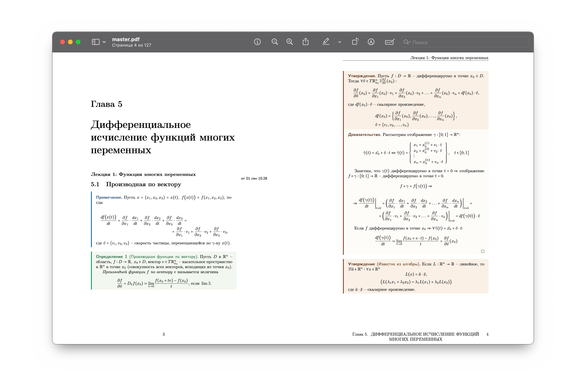
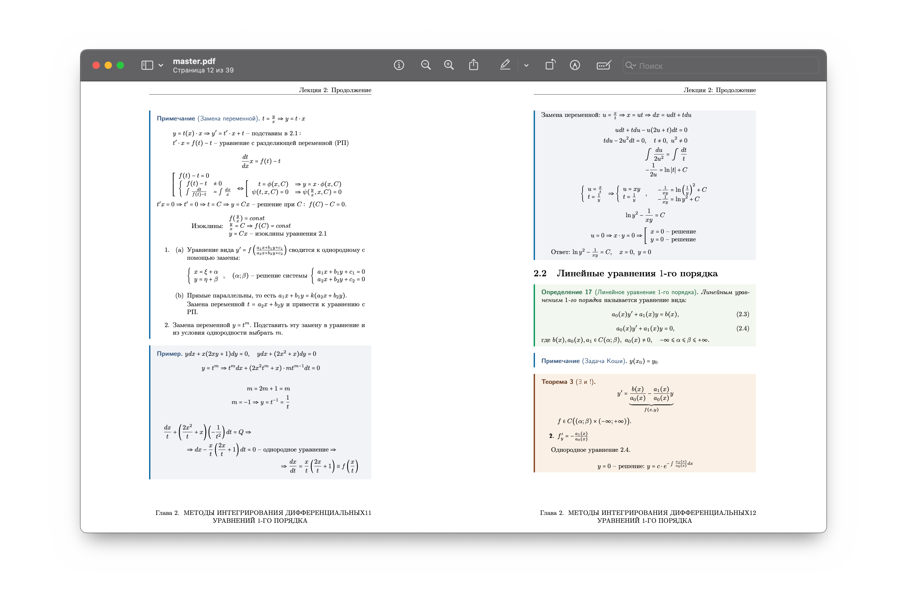

# university
Lecture notes, etc. of Omsk State University, Faculty of Digital Technologies and Cybersecurity, Applied Mathematics and Computer Science

> [!WARNING]
> The content of the repository is **filled by a student** of the faculty; the content may differ from the original source.

Example - [Calculus lecture note](https://github.com/zibliclub/university/blob/master/calculus/lecture-notes/master.pdf):

Example - [Differencial equations lecture note](https://github.com/zibliclub/university/blob/master/differential-equations/lecture-notes/master.pdf):

# Content

Lessons are divided into folders, depending on the availability of notes or other content for a given lesson — into additional folders. The `.pdf` file with the content is called `master.pdf`, the same in the case of notes, `.tex` code is divided into lectures and there is a `main.tex` file that combines them. There is also `preamble.tex`.

> [!NOTE] 
> For **hyperlinks** to work in .pdf files, you need to download the file.
 
| Lesson                                            | Lecture notes | Practices | Exam         |
| ------------------------------------------------- | ------------- | --------- | ------------ |
| Calculus                                          | 3rd semester  | ✘         | 3rd semester |
| Comprehensive analysis                            | ✔︎             | ✘         | ✘            |
| Differential equations                            | ✔︎             | ✘         | ✘            |
| Discrete mathematics and mathematical logic       | ✘             | ✘         | ✔︎            |
| Graph Theory and Combinatorial Algorithms         | ✘             | ✘         | ✔︎            |
| Optimization methods                              | ✔︎             | ✘         | ✘            |
| Programming languages and methods                 | ✘             | Labs 1-4  | ✘            |
| Probability theory                                | ✔︎             | ✘         | ✘            |
| Theory of algorithms and computational complexity | ✔︎             | ✘         | ✘            |
| Theory of automata and formal languages           | ✔︎             | ✘         | ✘            |
